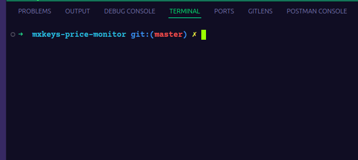

# MX Keys Price Monitor


Monitoramento automático de preços do teclado Logitech MX Keys com Web Scraping, PostgreSQL, Airflow e alertas via Telegram.

Este projeto coleta preços em diferentes sites, salva em um banco de dados PostgreSQL e envia alertas para o Telegram quando o preço cai abaixo de um limite definido.

# Funcionalidades

- Web Scraping automatizado em múltiplos sites

- Armazenamento em banco PostgreSQL

- Envio de alertas via Telegram

- Integração opcional com Airflow para agendamento diário

- Sistema configurado via .env (sem expor credenciais)

# Requisitos
## Python

- Python 3.11.5

- requests

- psycopg2

- python-dotenv

- beautifulsoup4 (se estiver usando parsing HTML)

## Banco de Dados

- PostgreSQL 13+

## Instalação do Docker

- Docker / Docker Compose

- Apache Airflow

# Como rodar o projeto

- Será necessário que você tenha o git instalado na sua máquina para criar o git e linkar com o github, se ainda nâo conhece o git e github, entre no  video da Jornada de Dados ensinando:

[Como instalar Python em 2024 + Pyenv, PIP, VENV, PIPX e Poetry](https://www.youtube.com/watch?v=9LYqtLuD7z4&t=194s)

- Para baixar o projeto, digite no terminal: 

```bash
mkdir mxkeys-price-monitor
cd mxkeys-price-monitor
```
- em seguida: 

```bash
git clone https://github.com/rafaelporfiriobarros/mxkeys-price-monitor.git
```

## Pyenv

- Primeiro de tudo, você deve instalar a versão mais estável do python para trabalhar com airflow no docker, que é a versão 3.11.5.
- Para isso, instale o Pyenv. O Pyenv é uma ferramenta que permite instalar e gerenciar múltiplas versões do Python no mesmo sistema — ideal para projetos diferentes, ambientes isolados e compatibilidade com Airflow, Django, Data Science, etc.
- Acesse o video a seguir da Jornada de Dados para instalar e conhecer melhor sobre o pyenv e ambientes virtuais:

[Como instalar Python em 2024 + Pyenv, PIP, VENV, PIPX e Poetry](https://www.youtube.com/watch?v=9LYqtLuD7z4&t=194s)

- Depois de ter instalado o pyenv e baixado o python 3.11.5, entre na pasta do projeto "mxkeys-price-monitor" e ative a versão do python no terminal utilizando:

```bash
cd mxkeys-price-monitor
```

- depois digite:

```bash
pyenv local 3.11.5

```

- Verifique no terminal a versão do python utilizando:

```bash
python3 --version
```

- ou tente:

```bash
python --version
```

- dependendo do seu sistema operacional.

## Ambiente virtual

- Agora será preciso criar um ambiente virtual para isolar dependências, garantindo que cada projeto tenha suas próprias bibliotecas e versões — sem conflito com outros projetos ou com o Python do sistema.

- Se você viu o vídeo da "Jornada de Dados" e entendeu como funciona um ambiente virtual, vamos criar um. No diretório do projeto, abra o terminal e digite:

```bash
python -m venv .venv
```

- Será criada uma pasta .venv com as dependências necessárias para o ambiente virtual.


- Em seguida, ative o ambiente. No Linux / macOS vocẽ utiliza:

```bash
source .venv/bin/activate
```
- No Windows vocẽ utiliza:

```bash
venv\Scripts\activate
```




## Configurando o arquivo .env

- Depois de todas as instalações necessárias, você precisa criar na raiz do projeto o arquivo chamado ".env".

- O arquivo .env (abreviação de environment) é um arquivo usado para armazenar variáveis de ambiente, normalmente informações sensíveis ou configurações que não devem ficar públicas no código — como:

    - senhas

    - tokens de API

    - URLs de banco de dados

    - chaves secretas

    - configurações específicas de ambiente (dev, teste, produção)

- No projeto o arquivo .env foi criado para receber um banco de dados postgres, e também a criação de variáveis que habilitam o sistema de alertas por Telegram. 
- PRICE_ALERT_THRESHOLD – Valor limite para disparar o alerta. Se o preço encontrado for menor ou igual a esse número envia mensagem no Telegram.

- USER_AGENT – Cabeçalho HTTP usado nas requisições. Simula um navegador real para evitar bloqueios de sites durante scraping.

- Se quiser testar, coloque um valor maior em PRICE_ALERT_THRESHOLD=900.00 por exemplo, entâo rode a DAG e a mensagem vai chegar no Telegram.

- O arquivo .env precisa ficar da seguinte forma:

```python
# Database
DB_HOST=postgres
DB_PORT=5432
DB_NAME=precos
DB_USER=airflow
DB_PASSWORD=airflow

# Telegram
TG_BOT_TOKEN="SEU TOKEN"
TG_CHAT_ID="SEU CHAT ID"

# General
PRICE_ALERT_THRESHOLD=700.00
USER_AGENT=Mozilla/5.0 (Windows NT 10.0; Win64; x64) AppleWebKit/537.36 (KHTML, like Gecko) Chrome/120.0 Safari/537.36
```

# Instalação do Docker

- Nesse projeto vamos utilizar o Docker para rodar o Airflow e o banco de dados Postgres, se você ainda nâo conhece o Docker, veja os links abaixo de como instalar, tanto para Windows, Linux e MacOS:

 - Windows:

[Como instalar o Docker no Windows](https://www.youtube.com/watch?v=ZyBBv1JmnWQ)

 - Linux(Ubuntu 24.04 LTS)

[Como instalar o Docker no Linux(Ubuntu 24.04 LTS](https://www.youtube.com/watch?v=J4dZ2jcpiP0)

- MacOS:

[Como instalar o Docker no MacOS](https://www.youtube.com/watch?v=-EXlfSsP49A)

- Depois da instalação, verifique se o Docker está rodando na sua máquina. Utilize o comando a seguir no terminal:

```bash
docker --version
```

# Instalação das Dependências

- Agora você precisa instalar as dependências, as bibliotecas necessárias para rodar corretamente o projeto.
- Na raiz do projeto existe um arquivo de texto chamado "requirements.txt".
- No seu terminal já totalmente configurado, digite o comando a seguir:

```bash
pip install -r requirements.txt
```

- O Pip é o gerenciador de pacotes do Python. Ele serve para instalar, atualizar e remover bibliotecas. É como a “Loja de Apps” do Python.
- O arquivo "requirements.txt" É um arquivo que lista todas as dependências necessárias para rodar um projeto Python. Ele facilita quando outra pessoa (ou você mesmo) precisa instalar tudo para rodar o projeto.

# Resumo das Instalações

- Instalação do Pyenv e ativação do Python 3.11.5
- Instalação do Git e criação do projeto no Github.
- Criação e ativação do Ambiente Virtual.
- Instalação do Docker.

# Iniciando o projeto

- Após finalizar todas as intalaçôes, é preciso iniciar o container Docker. Para isso, acesse a pasta infra:

```bash 
cd infra
```

- Em seguida, digite o comando para iniciar a criação do container Docker:

```bash
docker compose up
```

- Se tudo ocorrer bem, entre no seu navegador para acessar o localhost onde está o Airflow:


```
http://localhost:8080/

```

- Rode a DAG mxkeys_price_monitor do Airflow e aguarde o status ficar verde.

- Crie um Banco de Dados no Postgres - PgAdmin para visualizar os dados.

# Configuração do Telegram para receber as mensagens.

- Para receber mensagens no Telegram usando o seu TG_BOT_TOKEN e TG_CHAT_ID, você precisa fazer 3 passos obrigatórios:

## 1. Criar o BOT e obter o TG_BOT_TOKEN

- Abra o Telegram

- Procure @BotFather

- Envie: /start

- Envie: /newbot

- Escolha nome e username

- O BotFather entrega algo como:

```bash
1234567890:AAH-suaChaveAqui-ABCDE
```

- Esse é o TG_BOT_TOKEN (OK no seu .env).

## 2. Obter seu TG_CHAT_ID

- Abra o seu bot no Telegram

- Clique em Start (ou /start)

- Acesse no navegador:

```bash
https://api.telegram.org/botSEU_TOKEN/getUpdates
```
- Exemplo com seu token:

```ruby
https://api.telegram.org/bot7416358916:AAEjsjpg-AXtBWNCU2-oDwMS8WUhvqvD_FE/getUpdates
```

- A resposta virá algo como:

```json
{
  "ok": true,
  "result": [
    {
      "message": {
        "chat": {
          "id": "SEU_ID",
          "type": "private"
        }
      }
    }
  ]
}
```

- O chat.id = TG_CHAT_ID
- Você colocou no .env:
```ini
TG_CHAT_ID=SEU_ID
```

## 3. Conferir se o BOT pode te enviar mensagens

- Você PRECISA enviar pelo menos 1 mensagem para o BOT antes.

- Se você não deu /start no bot, o Telegram bloqueia o envio.

- Então faça isso:

 - Abra o Telegram

 - Busque o nome do seu bot (ex.: "meuscraper_bot")

 - Clique em Start

 - Pronto: agora o bot está autorizado a te enviar mensagens.


